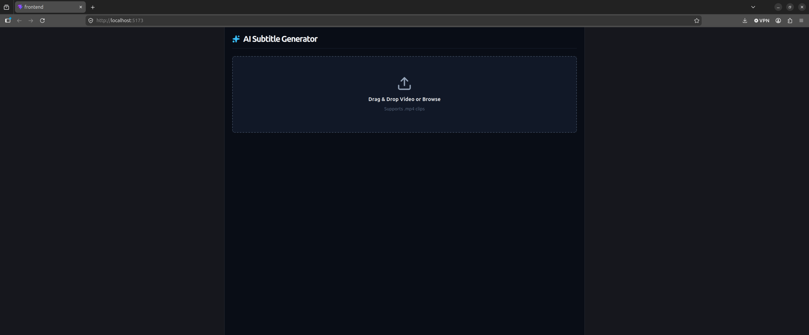
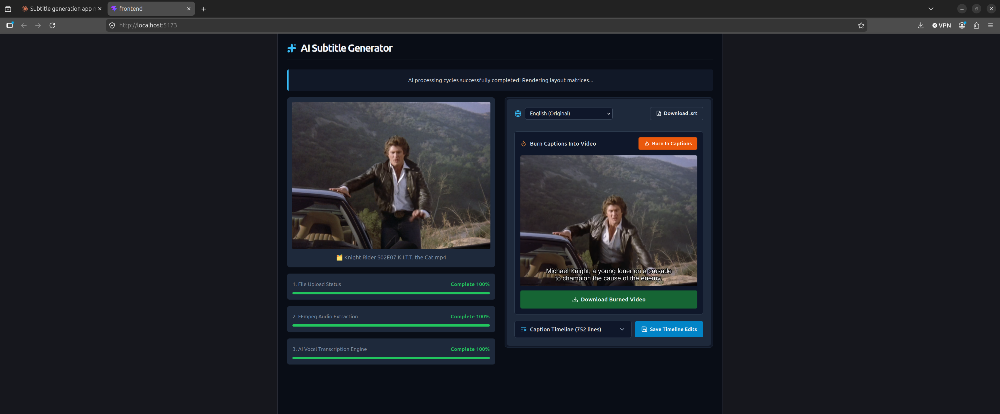

# AI Subtitle Generator

A full-stack video captioning pipeline that transcribes speech locally with Whisper, translates it into multiple languages, and lets you edit, export, or permanently burn the captions into the video — all with live progress streamed from the backend in real time.




## 📺 System Demonstration

[ai-subtitle-generator-demo.webm](./assets/ai-subtitle-generator-demo.webm)

## 🏗️ Architecture & Core Concepts

```
[React Frontend]
      │ (multipart upload)
      ▼
[FastAPI Backend] ──► [ffmpeg] ──► audio extraction (SSE progress)
      │
      ▼
[faster-whisper — local CPU transcription] (SSE progress)
      │
      ▼
[deep-translator — per-language translation] (SSE progress)
      │
      ├──► [Caption Editor: view / edit / save / export .srt]
      │
      └──► [ffmpeg subtitles filter] ──► hardcoded caption burn-in (SSE progress) ──► downloadable video
```

Every stage of the pipeline — audio extraction, transcription, translation, and burn-in — streams live progress to the frontend over Server-Sent Events, so the UI never guesses at percentages; it reflects real ffmpeg/Whisper output as it happens.

### Key Technical Achievements

- **Real-time multi-stage progress streaming.** Four independent long-running operations (ffmpeg extraction, Whisper transcription, line-by-line translation, and ffmpeg burn-in) each stream granular SSE progress events, parsed on the frontend into a unified, per-stage progress UI.
- **On-demand, non-redundant language generation.** Switching languages in the caption editor doesn't blindly re-run the pipeline — it checks whether that language has already been generated and only triggers transcription/translation for languages that don't yet exist on disk, avoiding wasted compute.
- **Safe ffmpeg filtergraph construction.** Burning captions into video requires passing a file path into ffmpeg's `subtitles` filter, which has its own escaping rules for colons, backslashes, and quotes distinct from shell escaping. Built a dedicated path-escaping utility to handle this correctly rather than relying on naive string interpolation.
- **Defensive SSE error handling.** Pipeline exceptions are caught inside the generator, logged server-side with full tracebacks, and explicitly surfaced to the frontend as failure events — rather than allowing a silent failure to be misreported as a completed 200 OK stream.
- **Resilient free-tier translation integration.** Wraps `deep-translator` with a per-language client cache and per-line fallback, so a single rate-limited or failed line degrades gracefully to the original English text instead of aborting the entire translation batch.

## 🛠️ Tech Stack

- **Backend:** Python, FastAPI, Server-Sent Events (SSE) for streaming progress
- **AI/ML:** [faster-whisper](https://github.com/SYSTRAN/faster-whisper) (`tiny` model, local CPU inference), [deep-translator](https://github.com/nidhaloff/deep-translator) (Google Translate, no API key required)
- **Media Processing:** ffmpeg / ffprobe (audio extraction, subtitle burn-in, duration probing) via subprocess, orchestrated with real-time progress parsing
- **Frontend:** React (Vite), lucide-react icons, a custom `useVideoWorkspace` hook centralizing all state and SSE stream handling
- **Subtitle Handling:** the `srt` library for parsing/composing `.srt` files

## Project Structure

```
backend/
  main.py                # FastAPI app: all endpoints + SSE pipelines
  transcribe.py           # Whisper model loading + transcription
  translator.py            # Translation via deep-translator
  temp_storage/             # Uploaded videos, audio, .srt files (created at runtime)

frontend/
  src/
    App.jsx
    components/
      VideoUpload.jsx
      VideoPlayer.jsx
      LanguageSelector.jsx
      CaptionEditor.jsx
      ProgressBar.jsx
    constants/
      languages.js         # Shared list of supported languages
    hooks/
      useVideoWorkspace.js   # All app state + API/SSE handling
```

## 🚀 Local Installation & Setup

### 1. Prerequisites

- Python 3.9+
- Node.js 18+
- **ffmpeg and ffprobe** on your `PATH`, with **libass** support for the burn-in feature (check with `ffmpeg -filters | grep subtitles`)

### 2. Backend Setup

```bash
cd backend
python3 -m venv venv
source venv/bin/activate        # Windows: venv\Scripts\activate
pip install fastapi uvicorn python-multipart faster-whisper deep-translator srt
uvicorn main:app --reload
```

The API boots on `http://localhost:8000`.

### 3. Frontend Setup

```bash
cd frontend
npm install
npm run dev
```

Open `http://localhost:5173` to view the application.

## 🔌 API Specification

### Generate Captions (Transcribe + Translate)

- **URL:** `/generate/{filename}`
- **Method:** `POST`
- **Response:** `text/event-stream` (SSE)

#### Request Body

```json
{
  "lang": "es"
}
```

#### Example SSE Stream

```
event: transcription_start
data: Connected to neural engine...

event: transcription_progress
data: 42

event: transcription_complete
data: 100

event: translation_progress
data: 78

event: translation_complete
data: 100
```

### Burn Captions Into Video

- **URL:** `/burn-in/{filename}/{lang}`
- **Method:** `POST`
- **Response:** `text/event-stream` (SSE), final event carries the output filename for download

```
event: burn_in_progress
data: 63

event: burn_in_complete
data: MyVideo_es_burned.mp4
```

### Other Endpoints

| Method | Endpoint | Description |
|---|---|---|
| `POST` | `/upload` | Upload a video file |
| `GET` | `/extract-audio-progress/{filename}` | SSE stream of audio extraction progress |
| `GET` | `/captions/{filename}/{lang}` | Fetch parsed caption lines |
| `PUT` | `/captions/{filename}/{lang}` | Save edited caption lines |
| `GET` | `/captions/{filename}/{lang}/download` | Download the `.srt` file |
| `GET` | `/download-video/{filename}` | Download or preview a video file |

## 🔭 Roadmap

- Swap the free-tier translation endpoint for a paid API (DeepL/OpenAI) to remove rate-limit risk on long videos and improve translation quality
- Add persistent storage (a real database) in place of flat-file storage keyed by filename
- Support GPU-accelerated Whisper inference and hardware-accelerated ffmpeg encoding (NVENC/QSV/VideoToolbox) for significantly faster processing
- Multi-source-language transcription (currently assumes English source audio)
